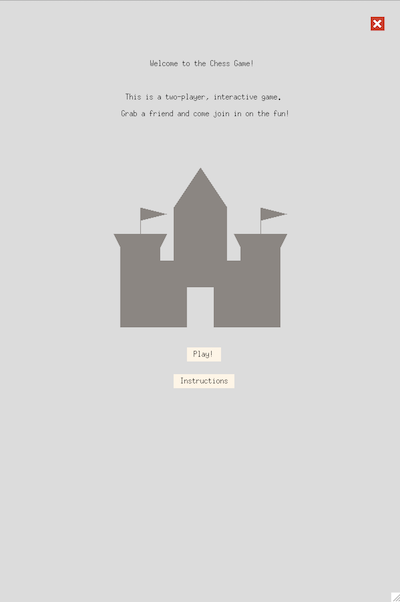
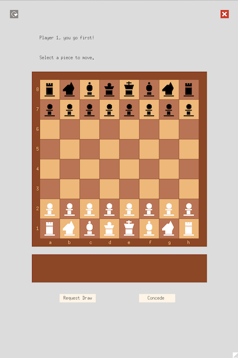
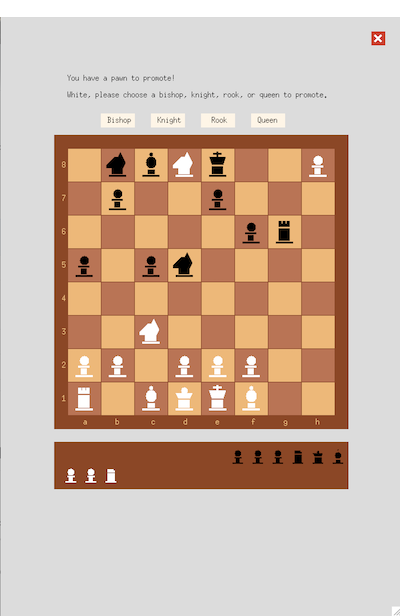
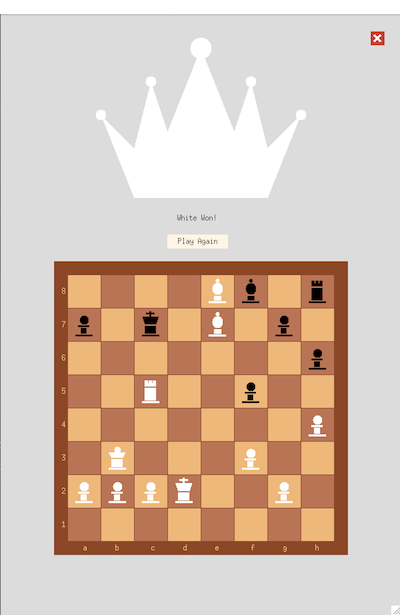
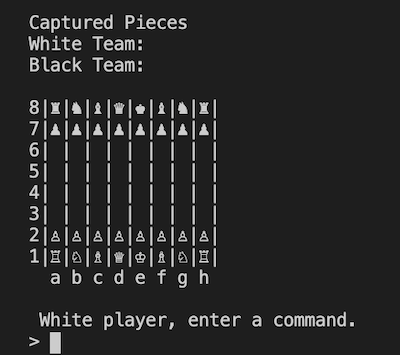
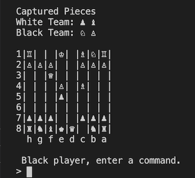

# Chess in OCaml
by Sophia Oguri, Ian Mackey, Alisha Kewalramani, Victor Su-Ortiz

### What Is It? 
This is a two-player, interactive chess game, written in OCaml, playable in the terminal or in an XQuartz GUI. Grab a friend and come join in on the fun!

### What Does It Look Like? 
In the XQuartz Gui:

   

In the Terminal:

 

### How to Play
1. Download code
2. Run ```$ make build``` in your terminal
3. Run ```$ make play``` in your terminal 
4. Follow the commands on the screen 
5. If you want to play with the XQuartz GUI, you must have XQuartz installed, 
and run 'opam install graphics'. Otherwise, you can play in the terminal GUI.  
5. Type 'quit' to exit game when it asks for a command
7. To test the system with the given test cases, run ```$ make test```

